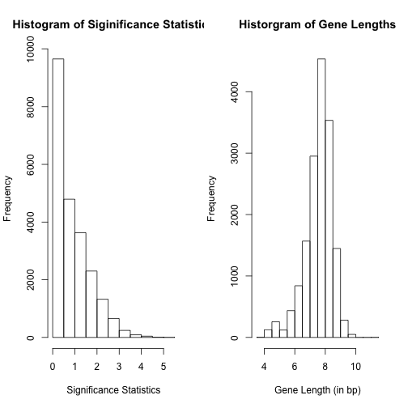

# GOglm
=============================================
*********************************************

The R package **GOglm** implements the `GOglm` approach discussed in Mi *et al.* [1]. It includes a summarized RNA-Seq data example (the prostate cancer dataset [2]) for methodological illustrations. This is a beta version under development. In this README file, we briefly outline the setup of the logistic regression model for length bias corrections, followed by discussions on access to the RNA-Seq datasets, Gene Ontology (GO) annotations, variable transformations, potential computational issues, choice of DE testing procedures and R/Bioconductor software information.

## GOglm and logistic regression

### Logistic regression and 2-by-2 contingency table

In the generalized linear model (GLM) framework, we used continuous measures of DE as predictors and interpret the results in terms of odds. Sartor *et al.* [3] proposed the LRpath method in the microarray context with the following setup

$$
logit\left[\pi(x)\right]=\beta_{0}+\beta_{1}x
$$

where `x` is the significance statistic defined as -log($p$-value). In the traditional 2-by-2 contingency table framework, a $p$-value cut-off for declaring DE genes is pre-specified so that each gene is associated with a indicator of 0 or 1. All genes are then cross-classified into a 2-by-2 table ready for Fisher's exact test or any other contingency-table-based approaches. If we use this binary indicator as the predictor in the equation above, the $p$-values for testing $\beta_{1}=0$  are roughly equivalent to those obtained using contingency tables, though with minor scale differences.

### GOglm using logistic regression for length bias adjustment

Equation (2) in paper [1]:

$$
logit\left[\pi(x)\right]=\beta_{0}+\beta_{1}x+\beta_{2}L
$$

is what we proposed to use for correcting length bias in GO enrichment analysis. The fundamental cause of length bias is that the transcript length becomes a confounding factor when it correlates with both the GO membership and the DE test significance. When we include transcript length `L` as a covariate, the coefficient $\beta_{1}$ now captures the correlation between the log odds of being in the specified GO category and the DE test significance -- conditional on gene lengths. A significant result from the hypothesis test $H0: \beta_{1} = 0$ indicates that the GO membership is correlated with the DE test significance even after adjusting for length bias.

## Access to the dataset

The first prostate cancer dataset first analyzed in [4] can be obtained from the `goseq` Bioconductor package. In our `GOglm` package, we extracted useful information from the dataset and some initial results, to illustrate the necessary inputs expected from the end-users. The following R codes will load `goseq` into R session and display the first five ENSEMBL genes with 1 indicating differential expression (DE) and 0 otherwise.


```r
library(goseq)
data(genes)
head(genes, 5)
```

```
## ENSG00000230758 ENSG00000182463 ENSG00000124208 ENSG00000230753 
##               0               0               0               0 
## ENSG00000224628 
##               0
```


Testing DE genes was implemented using the `edgeR` package. We adopted the common dispersion parameter approach to fit the negative binomial (NB) model using the quantile-adjusted conditional maximum likelihood (qCML) method, but the tagwise dispersion approach should also work. The following table shows part of the original raw counts table.


```
##                 lane1 lane2 lane3 lane4 lane5 lane6 lane8
## ENSG00000089057   174    98   164   208   252   173    96
## ENSG00000125520     6     1    17    17    23    11     5
## ENSG00000207427     0     0     0     0     0     0     0
## ENSG00000101152    41    33    32    46    35    44    13
## ENSG00000089199     0     0     0     0     0     2     0
```


This `n`-by-`r` matrix of RNA-seq read counts is also required for the NBP exact test `nbp.test()` implemented in `NBPSeq`, and for the nonparametric modeling of the variance `nbinomTest()` implemented in `DESeq`.

For ease of comparison with published results in our paper, in analyzing the prostate cancer data, we used `edgeR` with a common dispersion estimate to obtain DE test $p$-values. For the Arabidopsis dataset (to be included in package), we used `NBPSeq` to obtain DE test $p$-values. EdgeR and NBPSeq are both based on NB models for RNA-Seq read frequencies. The NB model captures potential extra-Poisson variation in RNA-Seq read frequencies between independent biological samples using a dispersion parameter. Other methods based on NB model include the tagwise or trend options in `edgeR`, or the `DESeq` approach. All of these methods use the same exact NB test for assessing DE, but differ in how they estimate the dispersion parameter as a function of the mean frequency.

The table below shows the partial result of the NB exact test using `edgeR`. The genes are ordered by DE testing $p$-values, and significance statistics will be obtained by proper transformations of these (un-adjusted) $p$-values.


```
##                  logFC logCPM    PValue       FDR
## ENSG00000127954 12.373  6.663 2.575e-80 1.275e-75
## ENSG00000151503  5.403  8.495 1.782e-65 4.410e-61
## ENSG00000096060  4.888  9.444 7.984e-60 1.317e-55
## ENSG00000091879  5.669  6.259 1.208e-54 1.495e-50
## ENSG00000132437 -5.931  7.945 2.950e-52 2.921e-48
```


## Expected inputs from end-users

In `GOglm` we provide two data frames based on this prostate cancer dataset: `ProsCan_DE` has valid gene identifiers as its row names, and the column of `DE-PVlas` is extracted from the aforementioned DE test output; `ProsCan_Length` has the same gene identifiers as `ProsCan_DE` and end-users must guarantee that they are in the same order. Otherwise, an error message will appear when calling the `prepare` function. Here are the first six lines of the `ProsCan_DE` data frame:


```r
library(GOglm)
data(ProsCan_DE)
DE_data <- ProsCan_DE
head(DE_data)
```

```
##                  DE-PVals
## ENSG00000127954 2.252e-80
## ENSG00000151503 1.532e-65
## ENSG00000096060 6.908e-60
## ENSG00000091879 1.094e-54
## ENSG00000132437 2.638e-52
## ENSG00000166451 6.313e-52
```


and here are the first six lines of the `ProsCan_Length` data frame:


```r
data(ProsCan_Length)
Length_data <- ProsCan_Length
head(Length_data)
```

```
##                 length
## ENSG00000127954   3923
## ENSG00000151503   5640
## ENSG00000096060   4106
## ENSG00000091879   2536
## ENSG00000132437   1968
## ENSG00000166451   1567
```


These two data frames are expected from the end-users to be passed to the `prepare` function for preparing a new data frame ready for use in the `goglm` function. See the example codes below:


```r
## Prepare a data frame to be passed to goglm():
gene_table <- prepare(DE_data, Length_data, trans.p = "d.log", trans.l = TRUE)
## Check first 10 rows of the data frame:
gene_table[1:10, 1:2]
```

```
##                 Sig.stat Length
## ENSG00000127954    5.217  8.275
## ENSG00000151503    5.012  8.638
## ENSG00000096060    4.922  8.320
## ENSG00000091879    4.830  7.838
## ENSG00000132437    4.786  7.585
## ENSG00000166451    4.778  7.357
## ENSG00000131016    4.775  8.564
## ENSG00000163492    4.641  8.242
## ENSG00000113594    4.607  9.220
## ENSG00000116285    4.588  8.033
## attr(,"class")
## [1] "prepGOglm"
```


The result above is a data frame with the same gene identifiers (in the same order) as the `ProsCan_DE` and `ProsCan_Length` data frames. The two columns `Sig.stat` and `Length` will be directly used in the `goglm` function for implementing `GOglm` in the GO enrichment analysis. To get a better understanding of the DE test results, we can call two functions:


```r
summary(gene_table)
```

```
## -------------------------------------------------------------- 
## | Total number of genes under study is 22743 
## | There are 0 genes without DE test p-values ( 0 % ) 
## | There are 6602 genes without length information ( 29.03 % ) 
## | Quantiles of significance statistics are 0 0.14 0.68 1.34 5.22 
## | Quantiles of gene lengths (in bp) are 3.64 7.15 7.69 8.15 11.32 
## -------------------------------------------------------------- 
## | Please make sure that significance statistics and gene lengths do not require any further transformations.
```

```r
plot(gene_table)
```

 


The `summary` generic function will produce some descriptive summaries based on the result from `prepare` (which is of class `prepGOglm`). The `plot` generic function will give two histograms if an object of class `prepGOglm` is provided.

## Implement `GOglm` for GO enrichment analysis

Once we obtain the new data frame generated by `prepare`, we can continue to pass the data frame as the first argument to `goglm`, our main function for implementing `GOglm`. We will use a subset of genes for illustration.


```r
## For illustration, only consider a subset of genes:
sub <- sample(seq(1, dim(gene_table)[1], 500))
gene_data <- gene_table[sub, 1:2]
```


Besides the data frame from `prepare`, we also need to have a *mapping list* with GO terms as entry names and gene identifiers as corresponding elements. The following codes can be used to get the list. For the `getgo` function, see the help document from `goseq`.


```r
## Prepare the 'category-to-genes' list:
library(goseq)
gene2cats <- getgo(rownames(gene_data), "hg18", "ensGene")
```

```
## Warning: package 'AnnotationDbi' was built under R version 2.15.2
```

```r
cat2genes <- revMap(gene2cats)
## What does the list look like?
cat2genes[1]
```

```
## $`GO:0000003`
## [1] "ENSG00000115268"
```


Now we have everything available to implement `GOglm`. We call the main function `goglm` below. Note that we specify `n=5` which excludes categories with fewer than 5 genes in the final GO ranking list, as discussed in paper [1]. The running time may be long if we include all genes.


```r
## Run goglm():
res <- goglm(gene_data, cat2genes, n = 5)
```

```
## Warning: NAs introduced by coercion
```

```r
names(res)
```

```
## [1] "GOID"   "over.p" "anno"   "rank"
```


For a summary of the `GOglm` results, use the generic `summary` function:

```r
summary(res)
```

```
## -------------------------------------------------------------- 
## | Total number of categories under study is 69 
## | The number of genes annotated to these categories ranges from 6 to 23 
## | Under 0.05 cut-off, the number of enriched categories is 7 
## --------------------------------------------------------------
```


We can also manipulate the results for more readable outputs:


```r
## For more readable outputs:
output <- cbind(res$over.p, res$anno, res$rank)
rownames(output) <- unfactor(res$GOID)
```

```
## Warning: NAs introduced by coercion
```

```r
colnames(output) <- c("over.p", "n.anno", "rank")
head(output)
```

```
##             over.p n.anno rank
## GO:0006810 0.03515      7    1
## GO:0051234 0.03515      7    2
## GO:0012505 0.04197      6    3
## GO:0031090 0.04197      6    4
## GO:0016021 0.04952      9    5
## GO:0031224 0.04952      9    6
```


## GO annotations

### Access to the GO database
As shown above, each row corresponds to one gene with "accessible" gene names, such as `ENSG00000127954` in the prostate cancer dataset. What makes "accessible" so important is that we need these identifiers to obtain corresponding GO annotations. We will then know which genes are annotated to any particular category so that the response variable (indicator of whether a gene is annotated to this category) can be constructed. 

The `getgo` function in `goseq` makes use of Bioconductor organism packages to obtain mappings between gene and GO IDs. These packages all have similar names as `org.<Genome>.<GeneID>.db` so that it's convenient to find the database for a particular organism. We loaded `org.Hs.eg.db` for the prostate cancer dataset. This database can be installed using

```r
source("http://www.bioconductor.org/biocLite.R")
biocLite(c("org.Hs.eg.db"))
```

Besides gene names, we still need to pass the "genome"" and  "gene identifier" used by the first argument `genes` to `getgo` and `getlength` functions in `goseq`. For organisms available in the UCSC genome browser, it is relatively easy to find such information using `supportedGenomes` and `supportedGeneIDs`, respectively. In this case, we specify `genome=hg18` and `id=ensGene`. So far, all information required is collected for the prostate cancer dataset. If the organism under study does not have a Bioconductor annotation database for GO mapping, then the user has to provide GO annotations in other ways.

The Bioconductor package `GO.db` is the only set of annotation maps describing the entire GO. It will be used after we identified top-ranked categories and would like to get more details about categories to see if they make biological sense.

### GO availability and gene filtering

In testing our GLM approach we find that the `goseq` function simplifies a key aspect in constructing the contingency table. The total number of genes $N$ is defined as `nrow(pwf)`. This works well if all genes under study have GO annotations available. However this is not true when we obtain a complete list of

```r
## need to load goseq for the getgo() function:
getgo(rownames(gene_table),"hg18","ensGene")
```

Those `$<NA>` values for genes are associated with `NULL` GO information. No matter which category is tested for enrichment, those genes without GO annotations will automatically be considered as "not in this category" but in fact we don't know which categories it belongs to. Among 22743 genes, only 12641 genes (55.58%) have annotations, so we believe it is more sensible to discard genes without annotations. This will drastically change the final list obtained by GOseq Wallenius.

## Variable transformations, computational issues and choice of DE testing procedures

Predictors in the logistic regression model, namely significance statistics and gene lengths, should be properly transformed in order to avoid computational issues. As a result of many DE testing $p$-values exactly equal to 1, log(-log($p$-value)) will produce `NaN` values not usable in R. Therefore, we use log(1-log($p$-value)) so that those genes' information can be retained.

Non-convergence of Newton-Raphson algorithm is more likely to occur when samples are small. This can be reflected in two ways from our data example: either more required iterations are required to achieve convergence or over-dispersion parameter not close to 1. Non-convergence is mostly suffered by specialized categories with very few annotated genes (say, less than 5).

We didn't explore how different methods for identifying DE genes will influence the downstream enrichment analyses. Some researchers believe that methods for DE testing are in some sense irrelevant to subsequent analysis (see `GOstats` package vignette, `GOvis`), but adopting the currently widely used approaches such as `edgeR`, `DESeq` and `NBPSeq` will make the results more trustworthy. We note in paper that these NB-based approaches are superior when biological replicates present, but potential differences in the final list may result from gene filtering criteria on the population genes, such as deciding fold-changes for (non-)expressed genes and/or discarding genes with unavailable $p$-values.

Bioconductor annotation databases are updated regularly as the state of biological knowledge changes, so that results might be slightly different as releases of packages change. Our analyses in the paper were based on R version 2.15.1 (2012-06-22) and Bioconductor release 2.9 (November 1, 2011). The results here in this README file are based on the lastest versions of R/Bioconductor packages.

## References

[1] Mi G, Di Y, Emerson S, Cumbie JS and Chang JH (2012) "Length bias correction in Gene Ontology enrichment analysis using logistic regression", PLOS ONE, 7(10): e46128.

[2] Li H, Lovci M, Kwon Y, Rosenfeld M, Fu X, et al. (2008) "Determination of tag density required for digital transcriptome analysis: application to an androgen-sensitive prostate cancer model", Proc Natl Acad Sci U S A 105: 20179-20184.

[3] Sartor M, Leikauf G, Medvedovic M (2009) "LRpath: a logistic regression approach for identifying enriched biological groups in gene expression data", Bioinformatics 25: 211-217.

[4] Young M, Wakefield M, Smyth G, Oshlack A (2010) "Gene ontology analysis for RNA-seq: accounting for selection bias", Genome Biol 11: R14.
